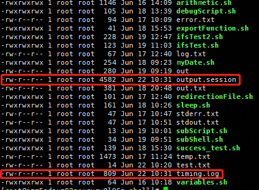
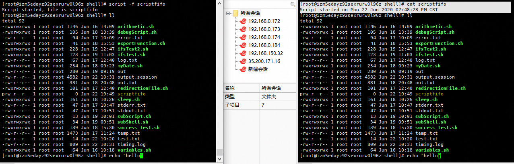

# Linux的命令
```text
  Linux的各种命令可以帮助我们完成各种繁杂的任务，使得我们的工作可以边得更加的轻松
```

## cat命令的使用
```text
  cat是命令通常用于读取，显示或者凭借文件内容，不过它所具备的能力远远不止这些。cat常用的参数选项有如下几个

-A、 --显示所有等效于-vET

-b、 --数字非空数字非空输出行，覆盖-n

-e等价于-vE

-E、 --每行末尾显示$

-n、 --所有输出行的编号

-s、 --挤压空白抑制重复的空输出行

-t相当于-vT

-T、 --显示选项卡将选项卡字符显示为^I

-u（忽略）

-v、 --显示非打印使用^和M-符号，除了LFD和TAB

例子1(-s选项只可以去掉重复的空白行)：
[root@xx shell]# cat -s test.txt 
1

2

3
例子2(tr可以移除空白行，甚至可以将连续的多个'\n'字符压缩成单个'\n')
[root@xx shell]# cat  test.txt |tr -s  '\n'
1
2
3
```
**将制表符效时为^|**
```text
对于一些编程语言，我们空格和指标符都是可以作为缩进的，但是所具备的含义不尽相同。cat可以使用-T选项来将指标符
标记成为^|
例子：
[root@xx shell]# cat -T test.txt 
1

2
^I^I^I^I^I^I
3


```

## 录制与回放终端会话
```text
  当你需要为别人在终端上演示某些操作或者是需要准备一个命令行教程时，通常你要边手动输入一遍演示，或者,你也可以录制
一段屏幕演示视频，然后再回放出来。使得看到的回放视频就好像是在现在再输入命令一般。我们可以使用script和scriptreplay命令来
实现。

例子：
[root@xx shell]# script -t 2> timing.log -a output.session
Script started, file is output.session
結束的時候要是有exit退出录制
再下面的图中可以看到有timing.log(存储时许信息)和output.session(存储命令输入信息)，我们可以按照下面的方式执行
上面的命令回放
[root@xx shell]# scriptreplay timing.log output.session 
```


**终端录制的原理**
```text
  通常，我们会录制桌面环境视频来作为教程使用。不过要注意的是，视频需要大量的存储空间来存储，而终端脚本文件
仅仅是一个文本文件，起文件大小不过是哥KB级别的大小。
  script命令同样可以建立可在多个用户之间进行广播的视频会话，这是一件很有意思的事，实现的步骤如下:
1.分别打开两个终端teminal1和teminal2.
2. 在终端使用如下的命令创建scriptfifo文件(可以看到已经创建了一个scriptfifo文件)
[root@xx shell]# mkfifo scriptfifo
[root@xx shell]# ll
total 92
-rwxrwxrwx 1 root root 1146 Jun 16 14:09 arithmetic.sh
-rwxrwxrwx 1 root root  105 Jun 18 13:39 debugScript.sh
-rw-r--r-- 1 root root   94 Jun 17 10:09 error.txt
-rwxrwxrwx 1 root root   41 Jun 18 15:53 exportFunction.sh
-rwxrwxrwx 1 root root  228 Jun 19 12:47 ifsTest2.sh
-rwxrwxrwx 1 root root  123 Jun 19 11:03 ifsTest.sh
-rw-r--r-- 1 root root   67 Jun 17 12:40 log.txt
-rwxrwxrwx 1 root root  254 Jun 18 09:23 myDate.sh
-rw-r--r-- 1 root root  280 Jun 19 09:19 out
-rw-r--r-- 1 root root 4582 Jun 22 10:31 output.session
-rw-r--r-- 1 root root  381 Jun 18 20:48 out.txt
-rwxrwxrwx 1 root root  101 Jun 17 12:40 redirectionFile.sh
prw-r--r-- 1 root root    0 Jun 22 19:35 scriptfifo
-rwxrwxrwx 1 root root  161 Jun 18 10:26 sleep.sh
-rw-r--r-- 1 root root   47 Jun 17 10:47 stderr.txt
-rw-r--r-- 1 root root   47 Jun 17 10:51 stdout.txt
-rwxrwxrwx 1 root root   13 Jun 19 10:01 subScript.sh
-rwxrwxrwx 1 root root   34 Jun 19 09:51 subShell.sh
-rwxrwxrwx 1 root root  139 Jun 18 15:30 success_test.sh
-rw-r--r-- 1 root root 1473 Jun 17 11:24 temp.txt
-rw-r--r-- 1 root root   14 Jun 22 10:20 test.txt
-rw-r--r-- 1 root root  809 Jun 22 10:31 timing.log
-rwxrwxrwx 1 root root   64 Jun 16 10:18 variables.sh

3. 在teminal1中输入
[root@xx shell]# script -f scriptfifo 
Script started, file is scriptfifo


4. 在terminal2中输入如下的命令
[root@xx shell]# cat scriptfifo 
Script started on Mon 22 Jun 2020 07:48:28 PM CST

经过上面步骤的执行可以看到无论在teminal1执行了上面命令，在teminal2都会同步
```



## 文件查找与文件列表
```text
  find是Unix/Linux命令行工具箱中比较强大的工具之一，这个命令能给我们带来很多的帮助，为此我们需要对它
有比较深入的理解。
  find命令的工作方式如下:沿着文件层次结构向下遍历，匹配符合条件的文件，并且指向相应的操作。
例子(打印文件和目录的列表)：
[root@xx shell]# find . -print
.
./subScript.sh
./subShell.sh
./scriptfifo
./error.txt
./redirectionFile.sh
./myDate.sh
./ifsTest2.sh
./test.txt
./sleep.sh
./variables.sh
./arithmetic.sh
./output.session
./log.txt
./success_test.sh
./ifsTest.sh
./debugScript.sh
./out
./exportFunction.sh
./temp.txt
./stderr.txt
./timing.log
./stdout.txt
./out.txt

-print指明打印出匹配文件的文件名(路径)。当使用-print选项时，'\n'作为用于分割文件的界定符
-print0指明使用'\n'作为界定符来打印每一个匹配的文件名。当文件名中包含换行符时，这个方法就有了用武之地。
```

**根据文件名或者正则表达式匹配搜索**
```text
1. 选项-name的参数指定了文件名所必须匹配的字符串。我们可以将通配符作为参数使用。*.txt能够匹配所有以.txt结尾的文件名。
选项-print在终端打印文件名或者文件路径。
例子:
[root@xx shell]# find /usr/shell -name "*.txt"
/usr/shell/error.txt
/usr/shell/test.txt
/usr/shell/log.txt
/usr/shell/temp.txt
/usr/shell/stderr.txt
/usr/shell/stdout.txt
/usr/shell/out.txt
选项iname(忽略大小写),该选项的作用和-name类似，只不过在匹配名字的时候会忽略大小写。
[root@xx shell]# ll
total 92
-rwxrwxrwx 1 root root 1146 Jun 16 14:09 arithmetic.sh
-rwxrwxrwx 1 root root  105 Jun 18 13:39 debugScript.sh
-rw-r--r-- 1 root root   94 Jun 17 10:09 error.txt
-rwxrwxrwx 1 root root   41 Jun 18 15:53 exportFunction.sh
-rwxrwxrwx 1 root root  228 Jun 19 12:47 ifsTest2.sh
-rwxrwxrwx 1 root root  123 Jun 19 11:03 ifsTest.sh
-rw-r--r-- 1 root root   67 Jun 17 12:40 log.txt
-rwxrwxrwx 1 root root  254 Jun 18 09:23 myDate.sh
-rw-r--r-- 1 root root  280 Jun 19 09:19 out
-rw-r--r-- 1 root root 4582 Jun 22 10:31 output.session
-rw-r--r-- 1 root root  381 Jun 18 20:48 out.txt
-rwxrwxrwx 1 root root  101 Jun 17 12:40 redirectionFile.sh
prw-r--r-- 1 root root    0 Jun 22 20:13 scriptfifo
-rwxrwxrwx 1 root root  161 Jun 18 10:26 sleep.sh
-rw-r--r-- 1 root root   47 Jun 17 10:47 stderr.txt
-rw-r--r-- 1 root root   47 Jun 17 10:51 stdout.txt
-rwxrwxrwx 1 root root   13 Jun 19 10:01 subScript.sh
-rwxrwxrwx 1 root root   34 Jun 19 09:51 subShell.sh
-rwxrwxrwx 1 root root  139 Jun 18 15:30 success_test.sh
-rw-r--r-- 1 root root 1473 Jun 17 11:24 temp.txt
-rw-r--r-- 1 root root   14 Jun 22 10:20 test.txt
-rw-r--r-- 1 root root    0 Jun 23 09:19 TEST.txt
-rw-r--r-- 1 root root  809 Jun 22 10:31 timing.log
-rwxrwxrwx 1 root root   64 Jun 16 10:18 variables.sh
[root@xx shell]# find -iname "test*" -print 
./test.txt
./TEST.txt

2. 如果我们希望匹配多个条件中的一个，可以采取OR条件操作：
例子：
[root@xx shell]# find . \( -name "*.txt" -o -name "*.pdf" \) -print
./error.txt
./test.txt
./TEST.txt
./demo.pdf
./log.txt
./temp.txt
./stderr.txt
./stdout.txt
./out.txt


3. 选项-path的参数可以使用通配符来匹配文件路径或者文件。-name总是用给定的文件名进行匹配。-path则将文件路径作为一个
整体进行匹配。
例子：
[root@xx shell]# find /usr/shell/  -path "*demo*" -print
/usr/shell/demo
/usr/shell/demo/demo2
/usr/shell/demo/demo2/demo.txt
/usr/shell/demo/demo.txt
/usr/shell/demo.pdf

4. 选项-regex的参数和-path类似，只不过-regex是基于正则表达式来匹配文件路径的。正则表达式式通配符的高级形式，
-iregex忽略大小写
例子(匹配.txt和.pdf结尾的文件)
[root@xx shell]# find . -regex ".*\(\.txt\|\.pdf\)$"
./error.txt
./demo/demo2/demo.txt
./demo/demo.txt
./test.txt
./TEST.txt
./demo.pdf
./log.txt
./temp.txt
./stderr.txt
./stdout.txt
./out.txt

5. 否定参数
find可以使用"!"实现参数否定
例子：
[root@xx shell]# find . ! -name "*.txt" -print
.
./subScript.sh
./subShell.sh
./scriptfifo
./redirectionFile.sh
./myDate.sh
./ifsTest2.sh
./demo
./demo/demo2
./sleep.sh
./variables.sh
./demo.pdf
./arithmetic.sh
./output.session
./success_test.sh
./ifsTest.sh
./debugScript.sh
./out
./exportFunction.sh
./timing.log
```
**6. 基于目录的深度的搜索**
```text
这个一般使用 -maxdept和-mindept选项来实现深度
```
**7. 根据文件类型进行搜索**
```text
类UNIX系统将一些都视为文件，文件具有不同的类型(普通文件，目录，字符设备，块设备，符号连接，硬连接)
-type可以对文件搜索进行过滤。
例子:
[root@xx shell]# find . -type d -print
.
./demo
./demo/demo2
./demo/demo.txt
```
**8. 根据文件时间进行搜索**
```text
UNIX/Linux文件系统中的每一个文件都有三种时间戳：
* 访问时间(-atime):用户最近一次访问文件的时间
* 修改时间(-mtime):文件内容最后一次被修改的时间
* 变化时间(-ctime):文件元素数据(metadata,例如权限或所有权)最后一次修改的时间
在Unix系统中并没有"创建时间"的概念. -atime,-mtime,-ctime可作为find的时间参数，它们可以整数值给出，单位是天。这些整数值通常还带有
-或者+:-表示小于，+表示大于.
例子：
1.打印出现在最近七天内被访问过的所有文件:
    [root@xx shell]# find . -type f -atime -7 -print
    ./subScript.sh
    ./subShell.sh
    ./error.txt
    ./redirectionFile.sh
    ./myDate.sh
    ./ifsTest2.sh
    ./demo/demo2/demo.txt
    ./test.txt
    ./sleep.sh
    ./TEST.txt
    ./demo.pdf
    ./arithmetic.sh
    ./output.session
    ./log.txt
    ./success_test.sh
    ./ifsTest.sh
    ./debugScript.sh
    ./out
    ./exportFunction.sh
    ./temp.txt
    ./stderr.txt
    ./timing.log
    ./stdout.txt
    ./out.txt

2. 打印恰好在七天前被访问过的文件
    [root@xx shell]# find . -type f -atime 7 -print
    ./variables.sh
    
3. 打印访问时间超过七天的所有文件
    [root@xx shell]# find . -type f -atime +7 -print    
```

**9. 基于文件大小的搜索**
```text
文件大小的单元:
* b ----- 块(512字节) 
* c ----- 字节
* w ------ 字
* k ------ 千字节
* M ------ 兆字节
* G ------- 吉字节

1. 根据文件的大小，可以这样搜索：
find . -type f -size +2k #大于2KB的文件
find . -type f -size 2k #等于2KB的文件
find . -type f -size -2k #小于2KB的文件
```

**10. 删除匹配的文件**
```text
[root@xx shell]# find . -type f -name "*.pdf" -delete
```
**11. 基于文件权限和所有权的匹配**
```text
文件匹配可以根据文件权限进行。列出具有特定的权限的所有文件：
find . -type f -perm 644 -print #打印权限为644的文件
```
**12. 结合find执行命令或者动作**
```text
  find命令可以借助选项-exec与其他命令进行结合。-exec算得上是find最强大的特性之一了。这个选项可以指定相关的操作
例子(将属于root用户的文件赋权给chendom)：
find . -type f -user root -exec chown chendom {} \;
-exec  参数后面跟的是 command 命令，它的终止是以“；”为结束标志的，所以这句命令后面的分号是不可缺少的，考虑到各个系统中分号会有不同的意义，所以前面加反斜杠。　　
{} 花括号代表前面find查找出来的文件名。
例子:
[root@xx shell]# find . -type f -name "*.txt" -exec printf "Text file: %s\n" {} \;
Text file: ./error.txt
Text file: ./demo/demo2/demo.txt
Text file: ./test.txt
Text file: ./TEST.txt
Text file: ./log.txt
Text file: ./temp.txt
Text file: ./stderr.txt
Text file: ./stdout.txt
Text file: ./out.txt


注意: 我们不能在-exec参数中直接使用多个命令，它只能够接收单个命令，不过我们可以用一个小手段来实现，将命令放入shell脚本里面
-exec ./commands.sh {} \;
```

**13. 让find跳过待定的目录**
```text
  在搜索目录并执行某些操作的时候，有时候为了提高性能，需要跳过一些子目录。将某些文件或者目录从搜索过程中排除的技术被称为"修剪".
例子:
find devl/source_path \( -name ".git" -prune \) -o \( -type f -print \)
这里\( -name ".git" -prune \)的作用是用于进行排除，它指明了.git目录应该被排除掉，而
例子2(忽略所有以txt结尾的文件)：
[root@xx shell]# find /usr/shell \( -name "*.txt" -prune \) -o \( -type f -print \)
/usr/shell/subScript.sh
/usr/shell/subShell.sh
/usr/shell/redirectionFile.sh
/usr/shell/myDate.sh
/usr/shell/ifsTest2.sh
/usr/shell/sleep.sh
/usr/shell/variables.sh
/usr/shell/arithmetic.sh
/usr/shell/example
/usr/shell/output.session
/usr/shell/success_test.sh
/usr/shell/ifsTest.sh
/usr/shell/debugScript.sh
/usr/shell/out
/usr/shell/exportFunction.sh
/usr/shell/timing.log
/usr/shell/test.md5
```

## 玩转xargs
```text
  我们可以使用管道将一个命令的stdout(标准输出)重定向到另一个命令的stdin(标准输入)。例如：cat foo.txt | grep "test"
  但是，这些命令只能以命令行参数的形式接收数据，而无法通过stdin接收数据流。在这种情况下，我们没有把那使用管道来提高那些只有通过
命令行参数才能提供的数据。此时xargs就可以发挥它的作用了。它擅长将白标准的输入数据转换称为命令行的参数.xargs能够处理stdin并将其转
换为特定命令的命令行的参数。xargs还可以将单行的或者多行的文本输入转换称为其他的格式，例如单行变多行的或者是多行变单行。

一. 将多行输入转换为单行输入出

例子：
[root@xx shell]# cat test.txt 
1

2

3
[root@xx shell]# cat test.txt |xargs
1 2 3

二.将单行输入转换为多行输出
  指定每行最大的参数数量n,我们可以将任何来自stdin的文件划分成多行，每行n个参数，每一个参数都是由""(空格)隔开的字符串
空格是默认的定界符。
例子：
[root@xx shell]# cat test.txt |xargs -n 2
1 2
3
```

**xargs的工作原理**
```text
  xargs命令拥有数量众多的而且用法接单的选项，这使得它恨适用于某些问题的场合。
1. 使用自己的定界符来分隔参数，用-d选项为输入指定一个定制的定界符:
[root@xx shell]# echo "splitXsplitXsplitXsplit" |xargs -d X
split split split split

2. 同时我们还可以结合-n选项将显示的参数列为多行
[root@xx shell]# echo "splitXsplitXsplitXsplit" |xargs -d X -n 2
split split
split split

3. 如果我们需要不同的入参，就会发现变得比较麻烦，但是使用xargs可以让我们的工作变得轻松优雅
[root@xx shell]# cat args.txt |xargs -n 1 ./cecho.sh 
arg1#
arg2#
arg3#

pleasure-of-command-chapter2/files/args.txt
pleasure-of-command-chapter2/files/cecho.sh

4. 上面的这个使用让我们看到了使用args在变化的部分的显示，如果存在不变化的部分，就需要使用-I选项，-I {}指定替换字符串。对于每一个命令参数，字符串{}
都会被从stdin读取到的参数所替换。
例子：
[root@xx shell]# cat args.txt |xargs -I {} ./cecho.sh -p {} -l 
-p arg1 -l#
-p arg2 -l#
-p arg3 -l#
```

**结合find使用xargs**
 ```text
  xargs和find算是一堆死党。两者结合使用可以让任务变得更加的轻松。不过人们通常确实以一种错误的组合方式使用它们。
例如： find . -type f -name "*.txt" -print |xargs rm -f这样做和危险。有时可能会删除不必要的删除的文件。我们没法预测
分隔的find命令的输出结果的定界符究竟是'\n'还是 ' '。如果文件名字中间存在' '或者是其他特殊符号，那么可能会误删。

1. 统计文件的个数
[root@xx shell]# find /usr/shell -type f -name "*.txt" -print0 | xargs -0 wc -l
   2 /usr/shell/error.txt
   0 /usr/shell/demo/demo2/demo.txt
   7 /usr/shell/test.txt
   0 /usr/shell/TEST.txt
   3 /usr/shell/args.txt
   3 /usr/shell/log.txt
 177 /usr/shell/temp.txt
   1 /usr/shell/stderr.txt
   1 /usr/shell/example.txt
   1 /usr/shell/stdout.txt
  25 /usr/shell/out.txt
 220 total

```

**结合stdin，巧妙使用while语句和子shell**
```shell script
[root@xx shell]# cat args.txt | { while read arg; do echo $arg; done }
arg1
arg2
arg3
<<======>>cat args.txt | xargs -I {} echo {}
子shell内部的多个命令可以作为一个整体来允许
cmd0 | (cmd1|cmd2;cmd3) | cmd4
如果cmd1是cd /,那么就会改变子shell工作目录，然而这种改变仅仅局限于子shell内部。cmd4则完全不知道工作目录发生变化了。

```

## 使用tr进行转换

```text
  tr是unix命令行行家工具箱中以减精美的小工具。她经常用来给编写又没得单行命令，具有很大得作用。tr可以对来自标准输入得字符进行替换，删除以及压缩。它可以将一组
字符变成另一组字符，因此通常也被称为转换（translate）命令。
  tr只能通过stdin(标准输入)，二无法通过命令行参数接受输入。它的调用格式如下：
tr [options] set1 set2 将来自stdin的输入字符从set1映射到set2，并将其输出写入stdout(标准输出)。set1和set2是字符类或者字符集。如果
两个字符集的长度不相等，那么set2会不断重复其最后一个字符，知道长度与set1相同，如果set2的长度大于set1，那么在set2中超粗set1长度的那
部分字符则全部被忽略。
例子(将小写转化为大写)：
[root@xx shell]# echo "hello world" |tr 'a-z' 'A-Z'
HELLO WORLD
在上面的例子当中'a-z' 'A-Z'都是合法的字符集，定义集合也和简单，不需要我们写一长串的字符，只需要起始字符和终结字符，
ROT13加密
[root@xx shell]# echo 123432 | tr '0-9' '9876543210'
876567
[root@xx shell]# echo 876567 | tr '9876543210' '0-9'
123432


补充：
1. 用tr删除字符
tr有一个选项-d，可以通过指定需要被删除的字符集合，将出现再stdin中的特定字符清除掉：
cat file.txt | tr -d "[set1]"
例子：
[root@xx shell]# echo "Hello 123 word 456" |tr -d '0-9'
Hello  word 

2. 字符集补集
我们可以利用选项-c来使用set1的补集。-c [set] 等同于定义了一个集合(补集),这个集合中的字符不包含[set]中：
tr -c [set1] [set2] set1的补集意味着这个集合中包含set1中没有的所有的字符(不急包含数字，空格字符和换行符至海外的所有字符)
例子：
[root@xx shell]# echo hello 1 char 2 next 4 | tr -d -c '0-9 \n'#指定了-d标识会被删除
 1  2  4

3. 用tr压缩字符
    tr命令再很多文本处理的环境中是非常有用的，连续重读的字符是会被要锁称为单个字符，而经常需要进行的一项任务就需要压缩成单个字符
而经常需要进行的一项任务就是压缩空白字符。
tr的-s选项可u压缩输入中重复的字符。
例子：
[root@xx shell]# echo "GUN      is not Unix,Recursive right=?" | tr -s ' '
GUN is not Unix,Recursive right=?
例子2：
[root@xx shell]# cat test.txt |tr -s '\n'
1
2
3
4
[root@xx shell]# cat test.txt | echo $[ $(tr '\n' '+') 0 ]
10
```
## 校验于核实
```text
  校验和(checksum)程序用来从文件中生产校验和密钥，然后利用这个校验和密钥合适文件的完整性。一份文件可以通过网络或者任何存储机制分发到不同的
的地点。处于多种原因，数据又可能再传输的过程中对视了若干位，从而导致文件损坏。通常这种情况会出现在文件下载。最广泛的的校验和技术是md5sum和
sha1sum。它们对文件内容使用相应的算法来生成校验和。
例子：
[root@xx shell]# md5sum test.txt  out.txt > multifile.md5 #将生成的md5校验和重定向到文件
校验文件是否又变化
[root@xx shell]# md5sum -c multifile.md5 
test.txt: OK #说明文件是正常的
out.txt: OK  #说明文件是正常的


```


## 排序/单一与重复
```text
  在对文本进行操作的时候，总是避免不了要对文本进行排序，那是因为对于文本处理任务而言，排序(sort)可以起到不小的作用。sort命令能够
帮助我们对文本文件和stdin进行排序操作。通常，它会介个其他的命令来生产需要的输出。uniq是一个经常和sort一同配合使用的命令。它的作用
是从文本或stdin中提取单一的行。sort和uniq能够查找重复数据。这则攻略将演示sort和uniq命令的大多数用法.
例子:
[root@xx shell]# cat test.txt 
1

2

3

4

8
7
6
5
4
[root@xx shell]# cat test.txt |tr -s '\n' | sort -r |uniq>sorted.txt 
[root@xx shell]# cat sorted.txt 
8
7
6
5
4
3
2
1

2. 将文本合并，但是不对文本进行排序
[root@xx shell]# sort -m sorted.txt test.txt 
1

2

3

4

8
7
6
5
4
3
2
1
8
7
6
5
4

3. 将列表排序(相关的列表数据看下面的连接)
[root@xx shell]# sort -nrk 3 data.txt 
2  huawei  3000
4  linux  2588
3  windows  2199
1  mac  2000

通常情况下，将就是文本文件中的列。列于列之间用空格分开，但是我们需要使用特定范围内的一组字符作为键，这个时候就需要明确地将键指定位某个范围
的字符，这个范围可以用键起止的字符位置来说明。

```

[将列表排序](files/data.txt)


**uniq命令**
```text
  uniq命令通过消除重复的内容，从给定输入中(stdin或命令行参数文件)展出单一的一行。它也可以用来找出输入中出现的重复行。uniq只能用于排过
序的数据输入，因此，uniq要么使用管道，要么将排过序的文件作为输入，并总是以这种方式于sort命令结合起来使用.
例子:
[root@xx shell]# cat uniqSort.txt 
bahs
foss
hack
hack
[root@xx shell]# uniq uniqSort.txt 
bahs
foss
hack
<<============>>
[root@xx shell]# sort -u uniqSort.txt 
bahs
foss
hack
<<==============>>
[root@xx shell]# sort uniqSort.txt | uniq
bahs
foss
hack

例子2：(显示只出现过一行的记录)
[root@xx shell]# sort uniqSort.txt | uniq -u
bahs
foss
例子3(统计各个各个单词的个数)
[root@xx shell]# sort uniqSort.txt | uniq -c
      1 bahs
      1 foss
      2 hack
例子4 (查找文件中重复出现的单词)
[root@xx shell]# sort uniqSort.txt |uniq -d
hack
结合-s和-w来指定键
* -s指定可以跳过得前N个字符
* -w指定用于比较得最大字符数
例子(-s指定跳过多少个字符，-w指定用于比较得最大字符数得方式来选的该键)
[root@xx shell]# sort data3.txt |uniq -s 2 -w 2
d:04:linux
u:01:gnu
u:02:bash
u:03:hack

uniq结合xargs
如果我们使用uniq的输出作为xargs的输入，那么最好为输出的隔行添加一个0值字节终止符。在默认的情况下，xargs命令会使用空格作为丁姐符分割参数
例如："this is a line"在xargs命令会将它们分割称为4个字符。如果使用0值字节作为终止符，那么\0就会被作为定界符，此时可以正确的处理参数

例子5 用uniq生成字符串样式

[root@xx ~]# echo this is a line | sed 's/[^\n\t\f\v]/&\n/g' | sed '/^$/d' | uniq -c | tr -d '\n' |sed 's/[^.]/&\n/g'
 
 
 
 
 
 
1
 
t
 
 
 
 
 
 
1
 
h
 
 
 
 
 
 
1
 
i
 
 
 
 
 
 
1
 
s
 
 
 
 
 
 
1
 
 
 
 
 
 
 
 
1
 
i
 
 
 
 
 
 
1
 
s
 
 
 
 
 
 
1
 
 
 
 
 
 
 
 
1
 
a
 
 
 
 
 
 
1
 
 
 
 
 
 
 
 
1
 
l
 
 
 
 
 
 
1
 
i
 
 
 
 
 
 
1
 
n
 
 
 
 
 
 
1
 
e

说明：s///g  是sed中替换的格式 
      &代表的是前面的匹配的字符
  
```

## 临时文件命名于随机数
```text
  编写shell脚本的时候，我们经常需要存储临时数据。最合适存储临时数据的位置是/tmp(该目录中的内容在系统重启之后会被清空)。有两种方法可以为
临时数据生成标准的文件名。

```

## 分割文件和数据
```text
  某些特殊的情况下，必须要把文件分割成多个小片段。小片段的文件可以提供可读性和日志。
例子：
生成大文件
[root@xx shell]# dd if=/dev/zero bs=100k count=1 of=/usr/shell/data.file
可以在/usr/shell/data.file生成为一个大小为100k的文件
[root@xx shell]# split -b 10k data.file #切分大文件
[root@xx shell]# ll #可以看到生成了10个切分的文件
total 360
...
-rw-r--r-- 1 root root  10240 Jul  3 13:01 xaa
-rw-r--r-- 1 root root  10240 Jul  3 13:01 xab
-rw-r--r-- 1 root root  10240 Jul  3 13:01 xac
-rw-r--r-- 1 root root  10240 Jul  3 13:01 xad
-rw-r--r-- 1 root root  10240 Jul  3 13:01 xae
-rw-r--r-- 1 root root  10240 Jul  3 13:01 xaf
-rw-r--r-- 1 root root  10240 Jul  3 13:01 xag
-rw-r--r-- 1 root root  10240 Jul  3 13:01 xah
-rw-r--r-- 1 root root  10240 Jul  3 13:01 xai
-rw-r--r-- 1 root root  10240 Jul  3 13:01 xaj
```
## 根据扩展名切分文件名
```text
  有一些脚本是依据文件名进行各种处理的，我们可能会需要在保留扩展名的同时修改文件名，转换文件格式(保留文件名的同时修改扩展名)或者
提取部分文件名。shell具有的内建功能可以依据不同的情况来切分文件名.
  借助%操作符可以轻松的将名称部分从"名称.扩展名"这种格式的文件名中提取出来.
例子(提取文件名)：
[root@xx shell]# file_jpg="sample.jpg"
[root@xx shell]# name=${file_jpg%.*}
[root@xx shell]# echo File name is:$name
File name is:sample
例子2(提取扩展名)：
[root@xx shell]# extension=${file_jpg#*.}
[root@xx shell]# echo file extension is ${extension}
file extension is jpg


```

## 批量重命名和移动
```text
   rename命令利用Perl正则表达式修改文件名。综合运用find，rename和mv，我们可以完成很多操作.
```
```shell script
#! /bin/bash

count=1;
for img in *.jpg *.png
do
new=image-$count.${img##*.}
mv "$img" "$new" 2> /dev/null 
if [ $? -eq 0 ]
then
echo "Renaming $img to $new"
let count++
fi
done

执行./rename.sh之后得到的结果：
#! /bin/bash

count=1;
for img in *.jpg *.png
do
new=image-$count.${img##*.}
mv "$img" "$new" 2> /dev/null 
if [ $? -eq 0 ]
then
echo "Renaming $img to $new"
let count++
fi
done
```
自己的重命名的脚本
```shell script
#!/bin/bash
for file in *.txt
do
newFile=$(echo $file|sed 's/&/_/g')
mv $file $newFile 2> /dev/null
if [ $? -eq 0 ]
then
echo "Renaming $file to $newFile"
fi
done                                                                                                                                                                                                                                              
```
文件名大小写切换
```shell script
for var in *;do mv $file $(echo $file |tr A-Z a-z);done
```


